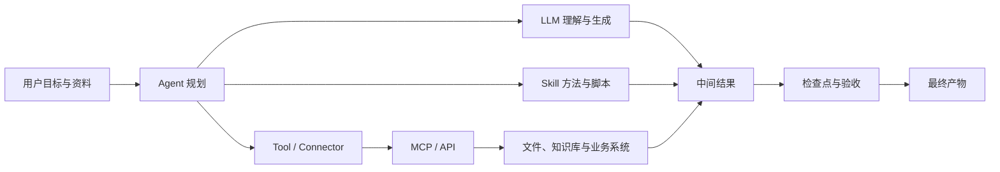
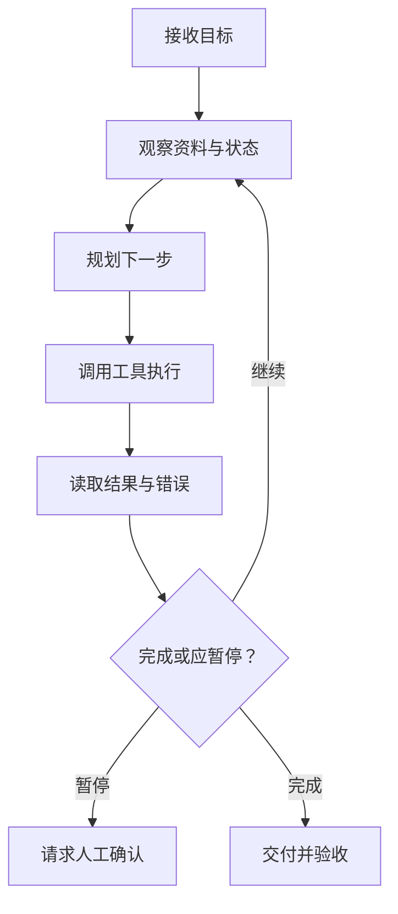

# AI 工作系統到底怎麼運轉？一章看懂 LLM、Agent、Skill 各管什麼事

前面十章講的是「怎麼用 WorkBuddy」。這一章講「為什麼這麼設計」——把 LLM、Token、Prompt、Agent、Tool、Skill、MCP、知識庫、工作流這些詞放進同一張圖，講清每個角色能做什麼、不能做什麼。你讀懂這一章，以後用任何 AI 工作工具，上手都會快很多。

## 先看全景：一次 AI 任務裡發生了什麼

一句話解釋：模型負責理解和生成，Agent 負責圍繞目標組織行動，Skill 提供專業方法，工具與 MCP/API 讓行動觸達真實世界，人負責邊界與驗收。五類角色裡，模型是大腦，Agent 是排程員，Skill 是專家手冊，工具與介面是手腳，你是裁判。

## LLM：會根據上下文預測內容的基礎模型

LLM（大語言模型）從大量資料裡學語言和知識模式，根據當前輸入生成最可能的後續內容。它本質是個「預測下一個內容」的引擎，不是資料庫，也不是會替你負責的人。

它擅長什麼：理解和改寫文本、從材料裡提取結構、生成草稿和程式碼、模仿格式與風格。

它不天然保證什麼：不保證每個事實都正確；不知道企業最新內部狀態（除非你提供資料或連線系統）；不自動擁有檔案、賬號、資料庫和網路權限；不承擔業務和法律責任，你也不能甩鍋給它。

為什麼會「幻覺」：模型的目標是生成連貫內容，不是內建事實資料庫。當資料缺失、問題含糊，或你要求它給確定答案時，它可能用合理但不真實的內容填補空白。這不是 bug，是「按機率補全」的副作用——**肯定和正確是兩件事**。

降低幻覺的辦法：你提供可靠資料；你要求它引用位置；你允許它回答「無法確認」；你把事實提取與建議生成分開；你對高影響結論人工複核。你問它要最新資料時，它給不出，除非你連上系統。

## Token 與上下文視窗：模型眼前能看到多少

Token 是模型處理文本的基本單位，不完全等於字數。上下文視窗是一次推理中模型能處理的輸入、歷史和輸出總量——你把它想成模型的**短期記憶容量**：裝得下才看得見，裝不下就得丟或壓縮。

上下文不是越長越好。你把全部檔案和幾個月對話都塞進一個任務，可能導致新舊要求衝突、關鍵資料被無關內容淹沒、成本和等待時間增加。更穩的做法：你按專案整理「當前規則、已確認事實、決策記錄和本次輸入」，長專案用檔案和專案記憶，你別把所有聊天記錄當資料庫用。

## Prompt：任務說明，不是神秘咒語

好的 Prompt 不以長度取勝，而以資訊是否足夠執行和驗收取勝——你寫 Prompt 是在寫一份能交給同事執行的任務單。

| 要素 | 要回答的問題 |
| --- | --- |
| 目標 | 最終解決什麼問題 |
| 輸入 | 使用哪些資料或系統 |
| 動作 | 分析、整理、生成還是寫入 |
| 約束 | 不能做什麼，採用什麼規則 |
| 輸出 | 交付什麼檔案或結構 |
| 驗收 | 怎樣判斷正確和可用 |

六要素裡最容易被你忽略的是**驗收**：沒有驗收標準，模型只能按自己的理解交差。

從一次性到可複用，是一個逐級固化的過程：Prompt（本次怎麼說）→ 任務卡（同類任務可填的結構）→ SOP（固定步驟和檢查點）→ Skill（把穩定 SOP、指令碼和資源封裝成可執行能力）。注意：不是每個 Prompt 都值得變成 Skill——你先重複成功，再逐步固化。

## Agent：能圍繞目標迴圈行動的執行體

Agent 不只是「回答一次」，而是持續執行一個迴圈：理解目標、觀察環境、決定下一步、呼叫工具、讀取結果、修正計劃，直到交付或觸發停止條件。

| 維度 | 聊天模型 | Agent |
| --- | --- | --- |
| 核心動作 | 生成回答 | 規劃、呼叫工具、執行和交付 |
| 過程 | 通常一次生成 | 多輪觀察與行動 |
| 風險 | 內容錯誤 | 內容錯誤 + 真實操作影響 |
| 控制 | 提示與複核 | 權限、檢查點、日誌和回滾 |

關鍵差異在最後一行：聊天模型說錯了最多誤導你；Agent 做錯了，可能真的刪了你的檔案、發了你的郵件、改了你的資料庫。所以 Agent 需要的不是更聰明的提示，而是更硬的護欄。你交給它的是目標和邊界，護欄由你來設。

Agent 的停止條件：好的 Agent 不應「永遠想辦法繼續」，你希望它在該停時停。關鍵輸入缺失、目標衝突、權限不足、成本超預算、動作不可逆、結果無法驗收時，它應暫停並請求你處理。一個不會停的 Agent，比一個笨 Agent 更危險。

## Tool：讓 Agent 真的能做事

Tool 是 Agent 可以呼叫的具體能力（讀檔案、執行搜尋、生成表格、發訊息）；Connector 通常是產品已經封裝好的第三方服務連線，你授權後直接使用。

普通使用者最容易誤解的一點：模型「懂」一件事，不代表它「能」做這件事。模型可以解釋「如何傳送郵件」，但只有拿到郵件工具和賬號權限後才能實際傳送。任務失敗時，你先問「工具通沒通、權限給沒給」，而不是「模型是不是不行」。

每個工具你要問自己五件事：用誰的身份；能讀取什麼；能修改什麼；資料會發到哪裡；失敗後如何停止和回退。

## Skill：可複用的專業工作方法

Skill 不是更聰明的模型，而是把某類任務需要的說明、指令碼、知識和模板組織起來。它的價值不在「讓模型變強」，而在**把容易做錯、容易遺漏的環節固定下來**——同樣的發票處理，讓模型每次現寫，十次可能有三種寫法；寫成 Skill，十次走同一條被驗證過的路。

你記住兩點：Skill 是「方法封裝」，不是「能力保證」；你裝了第三方 Skill，和裝瀏覽器外掛一個道理——方便，但你要先看它要什麼權限（讀哪些目錄、是否外發資料、要不要 API Key、怎麼停用），並先在隔離目錄測試。

## MCP：讓 AI 接入工具與資料的標準介面

MCP（Model Context Protocol）規定 AI 客戶端如何發現和呼叫外部工具、讀取資源，你把它理解為「AI 世界的 USB 介面」就行：工具提供方按一套標準暴露能力，AI 客戶端按同一套標準去用，你不用每家重新適配。

MCP 解決什麼：降低重複適配成本——你接一個 CRM、一個資料庫不用各寫一套專用連線。

MCP 不解決什麼：不自動判斷資料是否合規；不替你保管金鑰；不保證工具結果正確。它解決「怎麼連」，「連了之後安不安全」仍然是你的責任。

你用的時候分使用者級與專案級：公共能力放使用者級；客戶、資料庫等敏感連線優先專案級隔離，避免跨專案誤呼叫。

## API 與 MCP 的關係

API 是軟體之間互動的介面（HTTP 查資料、建立記錄）；MCP Server 可以在內部呼叫一個或多個 API，再以 Agent 更容易使用的方式暴露工具。一句話：API 是地基，MCP 是在地基上蓋的、Agent 能直接進出的門。用成熟 MCP 更方便，但你仍要審查它封裝了什麼請求和權限——方便不等於免審。

## 知識庫、RAG 與記憶

| 概念 | 儲存什麼 | 主要風險 |
| --- | --- | --- |
| 對話上下文 | 當前任務交流 | 太長、衝突、過期 |
| 知識庫 / RAG | 可檢索事實與資料 | 來源差、版本舊、檢索不到 |
| 記憶 | 偏好、長期規則、專案狀態 | 錯誤被長期沿用 |

一句話區分：上下文是這次聊天的短期記憶，知識庫是隨時可查的資料室，記憶是你跨任務保留的長期設定。記憶最危險的地方是「它自己不會發現過期」——你半年前寫錯的一條規則，會被 Agent 當真理反覆用。你往記憶裡寫一條規則，它就記住，所以你更得謹慎。

## Workflow 與 Agent 的區別

Workflow 是你熟悉的標準化生產線：步驟在設計時就定好，按順序或分支執行。

Agent 是會思考、能自己拿主意的執行者：只給目標，執行時自己決定下一步怎麼走。

| 維度 | Workflow | Agent |
| --- | --- | --- |
| 路徑是否預設 | 是，設計時定好 | 否，執行時決定 |
| 可控性 | 高，容易預測和回滾 | 較低，路徑可能變化 |
| 除錯難度 | 低，步驟清晰可追 | 高，需看日誌和中間狀態 |
| 適用場景 | 步驟明確、可重複、合規要求高 | 路徑不確定、需環境反饋、開放目標 |
| 典型失敗 | 卡在某步、分支沒覆蓋 | 跑偏、無限迴圈、越權操作 |

常見誤區：「Agent 一定比 Workflow 強」——不對，確定任務用 Workflow 更穩更省；「Workflow 不能含智慧」——錯，節點完全可以呼叫模型做摘要、分類，只是「走哪條路」由流程定；「Agent 全自動就最好」——過度放權會讓失敗更難定位。

兩者如何協同：Agent 把穩定的子任務寫成固定流程（Skill 背後就是 Workflow），只在不確定處自己判斷；生產線上某個判斷節點，也可以交給 Agent 處理非結構化輸入。你按活的性質，決定哪段交給 Workflow、哪段交給 Agent。

## 新手常見問題

**LLM、Agent、Skill 我老是分不清誰幹啥？**
你記這句：模型是大腦（理解和生成），Agent 是排程員（圍繞目標組織行動），Skill 是專家手冊（提供專業方法），工具與介面是手腳（觸達真實世界），你是裁判（管邊界和驗收）。

**為什麼 AI 會一本正經編瞎話（幻覺）？**
因為它的目標是生成連貫內容，不是查事實庫。資料缺失、問題含糊、你逼它給確定答案時，它會用合理但不真實的內容填空。對策：你給可靠資料、允許它說「無法確認」、高影響結論你人工複核。

**我的任務老跑偏，是模型不行嗎？**
你先別怪模型。任務失敗時你先問「工具通沒通、權限給沒給」——模型「懂」發郵件，不代表它有發郵件的工具和賬號。你把工具和權限理順，往往比換模型管用。

**Prompt、Skill、Workflow 該從哪開始用？**
你先寫好 Prompt（材料、結果、邊界說清）；同一類活你反覆說同樣的叮囑，就固化成 Skill；步驟明確、要可重複的活，你再做成 Workflow。不是每個 Prompt 都值得變 Skill，你先重複成功再固化。

---

下一步：回到能立刻上手的——[WorkBuddy 載入一個真正用得上的 Skill →](/zh-tw/workbuddy/05-skills/)

> 把這套認知用起來：[自動化任務](/zh-tw/workbuddy/10-automation/)是 Workflow，[專家團](/zh-tw/workbuddy/06-experts/)是多 Agent，[Skill](/zh-tw/workbuddy/05-skills/) 是方法封裝——讀完這一章再回頭看它們，結構會清晰得多。
