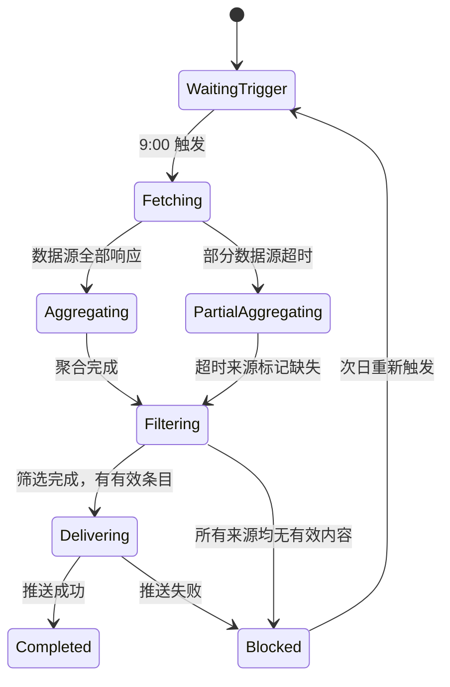

# 自動化任務怎麼跑得穩？用每日選題聚合講清狀態機、冪等和降級

你把手動跑通的任務設成定時任務，本以為從此高枕無憂——結果某天資料來源抽風，推送了一堆半截內容，或者重試把同一條訊息發了三遍。自動化真正難的不是「跑起來」，而是「穩定執行」。這篇用「每日 AI 熱點選題聚合」當貫穿案例，把從手動到定時要處理的問題一次講清。你照著做，定時任務就能少出岔子。

## 案例背景：內容博主的每日選題任務

AI 領域更新快，你每天要從多個資訊源篩出當天值得寫的選題。你手動逐一翻閱耗時又容易漏。一個典型的選題需求長這樣：

```text
我是一名 AI 領域的博主，主要內容方向是 AI 教程、AI 工具、AI Coding、AI 測評等。
幫我找今日的 AI 領域熱點，方便篩選當天的選題內容。
來源：
- 微信公眾號近期爆款文章（@wechat-article-search）
- GitHub 今日熱門 AI 專案（@GitHub熱門專案）
- 多引擎 AI 新聞聚合（@多引擎搜尋）
- AI 熱點追蹤（@AIHOT）
```

你手動執行一次，WorkBuddy 會同時呼叫四個資料來源，整合輸出一份當日 AI 熱點清單。你跑通後，下一步就是設為定時任務：每天早上 9:00 自動執行，結果推到指定位置。


## 自動化前的三個門檻

不是所有任務都適合立刻自動化。你先拿下面三條卡一下：

1. **同一 Prompt 已手動執行至少三次**，輸出質量和格式基本穩定；
2. **觸發條件、輸入來源和驗收標準清楚**：什麼時候執行、依賴哪些資料來源、輸出什麼格式；
3. **有 owner、有告警、有停用方法**：任務失敗時誰處理，如何臨時停用不影響其他流程。

你如果還在頻繁改 Prompt 或資料來源不穩定，就先手動跑，不急著自動化。

## 設定自動化任務

你手動執行確認效果後，在同一對話方塊裡直接告訴 WorkBuddy：

```text
把這個任務設定為自動化，每天早上 9:00 執行，
結果傳送到 [指定飛書群 / 郵件 / 企微通知]。
```

WorkBuddy 會將當前 Prompt 和資料來源配置儲存為定時任務，按設定時間自動執行。


## 把自動化任務設計成狀態機

自動化不是「跑起來就行」。你真實環境裡每次執行都可能撞上：資料來源超時、當日無相關條目、API 限流、推送目標不可達。你把它設計成狀態機，每個狀態都有明確的成功條件和失敗出口：



你記住關鍵原則：部分資料來源失敗不應阻斷整體任務，你標記缺失後繼續聚合；推送失敗你應保留結果並告警，不丟失已生成的內容。

## 資料來源就緒檢查

你定時觸發不等於資料來源已就緒，每次執行開始時你先檢查可用性：

| 資料來源 | 檢查項 | 不可用時的處理 |
| --- | --- | --- |
| @wechat-article-search | 搜尋 API 可達，返回非空結果 | 標記缺失，繼續其他來源 |
| @GitHub熱門專案 | GitHub API 未限流 | 退避重試一次，失敗則標記缺失 |
| @多引擎搜尋 | 搜尋引擎可達 | 標記缺失，繼續其他來源 |
| @AIHOT | 熱點追蹤服務正常 | 標記缺失，繼續其他來源 |

四個來源中至少三個正常，你才輸出完整熱點清單；全部失敗時你進入 Blocked 狀態並推送告警，次日重新觸發。

## 內容質量門禁

資料來源可達不代表內容有效。你聚合後過濾四個維度：相關性（真屬於 AI 領域）、時效性（當日內容，排除過期熱點）、重複性（同一事件多來源合併展示）、最低數量（有效條目少於 5 條時標註「當日熱點不足」）。

質量分三檔：**pass** 正常輸出；**warning** 部分來源缺失，輸出頂部說明；**blocked** 有效條目不足，不推送正文只推送說明。

## 輸出結構固定

```text
📋 AI 熱點選題日報 — 2026-07-10

【今日概況】
有效條目：18 條 | 來源：4/4 | 執行時間：09:02

🔥 高熱度（適合快速蹭熱點）
1. [模型名稱] 釋出，[核心能力] — 來源：AIHOT + GitHub
   熱度指數：★★★★★ | 建議角度：功能測評 / 使用教程

📈 潛力方向（適合深度分析）
2. [話題] 引發討論 — 來源：微信公眾號
   熱度指數：★★★ | 建議角度：觀點分析 / 案例拆解

⚠️ 資料來源說明
GitHub：正常 | 微信：正常 | 多引擎搜尋：正常 | AIHOT：正常
```

格式固定後，你 5 分鐘內就能完成選題判斷，而不是每次重新整理格式。

## 推送目標與冪等

| 推送目標 | 適用場景 | 注意事項 |
| --- | --- | --- |
| 飛書群訊息 | 團隊共享選題 | 記錄 message ID，避免重複推送 |
| 個人通知 | 個人使用 | 同上 |
| 飛書檔案（追加） | 保留歷史記錄 | 按日期追加，不覆蓋歷史 |
| 郵件 | 跨平臺通知 | 記錄發件 ID |

你記住**冪等原則**：某次任務因推送失敗而重試時，不應重複傳送已成功推送的內容。你每次執行生成唯一批次 ID（如 `ai-hotspot-2026-07-10`），推送成功後記錄狀態，重試時檢查狀態跳過已完成步驟。

## 超時和重試策略

| 失敗型別 | 是否重試 | 策略 |
| --- | --- | --- |
| 資料來源 API 超時 | 是 | 等待 10 秒後重試一次，仍失敗則標記缺失 |
| GitHub API 限流（429） | 是 | 按 Retry-After 等待，最多 2 次 |
| 認證失效（401/403） | 否 | 轉人工處理，不自動重試 |
| 推送目標不可達 | 是 | 指數退避重試 2 次，失敗則告警並保留結果 |
| 聚合結果為空 | 否 | 進入 blocked，推送說明，次日重新觸發 |

你只針對臨時性故障重試，不對輸入問題或配置問題重試。

## 斷點續跑與可行動告警

你每次執行生成狀態檔案，記錄已完成的步驟和產物（批次 ID、狀態、各來源狀態、條目數、最後錯誤）。推送失敗後重試，你從 `delivering` 步驟繼續，不重新抓取和聚合。

你讓告警內容能讓人立即判斷如何處理——批次、狀態、失敗原因、影響、建議處理步驟、恢復入口。「任務失敗，請檢視」不足以讓你處理。

## 降級交付與日誌

部分資料來源失敗時你不應等全部就緒：3 個及以上來源正常 → 輸出清單並標註缺失；2 個正常 → 輸出簡化清單並標註不完整；1 個或 0 個 → 不輸出正文，只推送說明和告警。你讓降級結果顯式標記來源覆蓋情況，**不偽裝成完整執行**。

你每次執行記錄：批次 ID 和觸發方式、各資料來源響應狀態和耗時、聚合與過濾後條目數、推送結果、總耗時和錯誤、執行成本（Token、API 呼叫）。日誌不記錄熱點內容正文。

## 上線前演練

你上線前先按這張表逐場景演練一遍：

| 場景 | 預期行為 |
| --- | --- |
| 所有資料來源正常 | 輸出完整清單，推送成功 |
| GitHub API 限流 | 退避重試，仍失敗則標記缺失，繼續聚合 |
| 當日無 AI 相關熱點 | 有效條目不足，輸出說明，不推送空清單 |
| 推送目標不可達 | 重試 2 次，失敗則告警並保留結果 |
| 重複觸發（手動與定時同時） | 檢測批次 ID，跳過重複執行 |

## 自動化任務定義模板

你照這個模板把任務寫清楚，後面維護省事：

```text
任務名稱：AI 熱點選題日報
觸發方式：每天 09:00（工作日）
Prompt：[完整 Prompt 文本]
資料來源：@wechat-article-search / @GitHub熱門專案 / @多引擎搜尋 / @AIHOT
質量門禁：有效 AI 相關條目 ≥ 5 條；資料來源可用數量 ≥ 3 個
輸出格式：結構化熱點清單（含來源、熱度、建議角度）
推送目標：[飛書群 / 個人通知 / 飛書檔案追加]
冪等控制：批次 ID = ai-hotspot-{date}，推送成功後標記，不重複推送
重試策略：資料來源超時重試 1 次；推送失敗退避重試 2 次；其他失敗轉人工
告警接收：[個人飛書通知]
owner：[博主本人]
停用方式：WorkBuddy 自動化任務管理頁 → 暫停
```

## 從個人自動化到團隊服務

| 維度 | 個人使用 | 團隊服務 |
| --- | --- | --- |
| 推送目標 | 個人通知 | 團隊飛書群 |
| 選題方向 | 單一方向 | 多方向分類推送 |
| 稽核流程 | 個人判斷 | 主編確認後分發 |
| 故障處理 | 自己處理 | 有 owner 和備份處理人 |
| 成本歸屬 | 個人賬戶 | 團隊預算 |

你擴充套件為團隊服務需要補充：明確 owner、建立執行手冊、設定權限（誰能改 Prompt 和推送配置）、制定變更流程。

**自動化的高階形態，不是完全沒有人，而是正常路徑少打擾人，異常路徑能及時找到正確的人。** 你任務上線後根據使用反饋持續迭代（Prompt 最佳化、資料來源調整、格式迭代、時間調整），每次調整都遵循「改 → 手動驗證 → 重新儲存」的流程，不直接在定時任務上實驗。

## 常見問題

**我跑通一次的任務，能直接設成定時嗎？**
你至少手動跑三次、輸出穩定了再自動化。觸發條件、資料來源、驗收標準不清楚的任務，設成定時只會把不穩定放大。

**某個資料來源掛了，整個任務會失敗嗎？**
不會，如果你設計成狀態機。部分來源超時或缺失，你標記後繼續聚合；只有全部失敗才進 Blocked 並告警，第二天重跑。

**重試會不會把同一條訊息發好幾遍？**
不會，前提是做好冪等。你給每次執行一個唯一批次 ID，推送成功後記錄狀態，重試時跳過已完成步驟，就不會重複發。

**推送失敗的內容會丟嗎？**
不該丟。你讓任務在推送失敗時保留已生成結果並告警，從 `delivering` 步驟續跑，不用重新抓取和聚合。

**團隊用和個人用差在哪？**
差在 owner、稽核和權限。你擴充套件成團隊服務時，要明確誰改 Prompt、誰確認分發、故障誰接手，再補執行手冊和變更流程。
