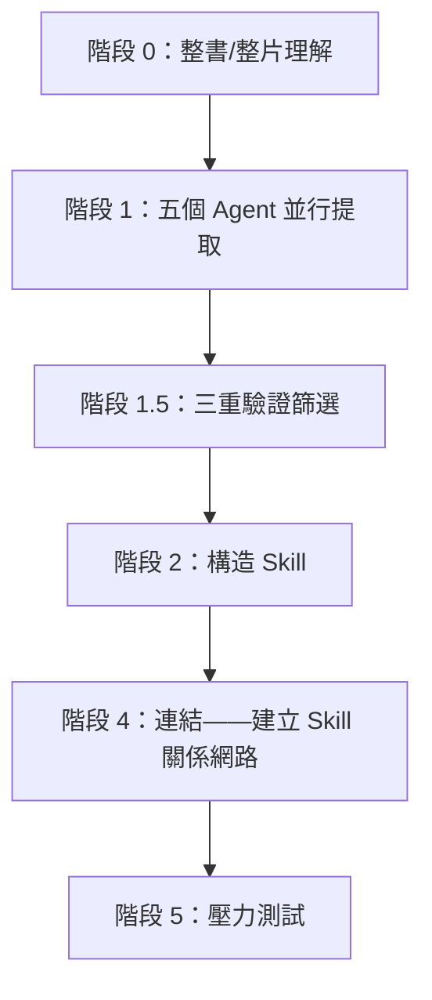
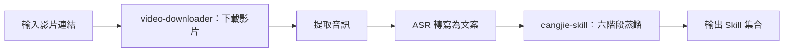

# 第 22 章 打造 Skill：將書和影片蒸餾為可執行 Skill

除了把自己的 SOP 沉澱為 Skill，還有一個更簡單的辦法：用 [cangjie-skill](https://github.com/kangarooking/cangjie-skill)（倉頡 skill，v1 蒸餾書，v2 增加影片蒸餾）把知識蒸餾成 Skill。


本章回答兩個問題：如何將書本和影片中的方法論轉化為 Agent 可自動呼叫的 Skill，以及這與 RAG 檢索的本質差別在哪裡。

## 問題起點：知識讀了但用不起來

AI 在訓練時已經攝入了大量經典著作，但在實際問答中往往輸出"正確的廢話"——每個字都對，但缺乏針對特定問題的可落地步驟。這不是幻覺問題，而是**呼叫機制問題**：AI 知道書裡有什麼，但不知道該在什麼場景下主動調出哪個框架。

人類讀者面臨同樣的問題：讀完一本書，筆記做了、金句劃了，兩週後遇到真實問題，那些方法論卻抓不住——知識在記憶裡，但啟用路徑不清晰。知識精餾要解決的，就是這個"學了用不上"的問題。

## 知識精餾的定義

**知識精餾（Knowledge Distillation for Skills）**：從書本或影片中，提取出具有獨立觸發條件和執行步驟的原子化知識單元（Skill），使 Agent 在遇到對應場景時能夠自動啟用並給出可落地的行動路徑。

化學中的精餾按沸點把混合物分離成純淨組分；知識精餾按"框架 / 原則 / 案例 / 反例 / 術語"五個維度把知識分離，只把真正有用的提純成可執行 Skill。

知識精餾**不是**：摘要（壓縮原文）、讀書筆記（結構化原文）、RAG 索引（儲存原文片段供檢索）。它是將方法論轉化為 Agent 能在真實場景下自動呼叫的執行單元。

## 六階段蒸餾 SOP



以蒸餾《文案創作完全手冊》為例：


### 階段 0：整書 / 整片理解

不從摘取金句開始，而是先讀清整本書的骨架：全書主旨、核心論證鏈、關鍵術語的定義和使用、作者自身的侷限與盲點。這一步決定後續提取的質量上限——跳過它直接提取，容易把作者反對的觀點當成他支援的方法論。

### 階段 1：五個 Agent 並行提取

五個 Agent 同時從五個維度掃描全文，獨立工作、互不干擾，避免單線閱讀的視角遺漏：

| Agent | 提取目標 |
| --- | --- |
| 框架提取 | 作者構建的分析或決策框架 |
| 原則提取 | 可跨場景複用的行為原則 |
| 案例提取 | 正面案例和成功路徑 |
| 反例提取 | 失敗案例和反面教訓 |
| 術語詞典 | 專有術語及其定義 |


### 階段 1.5：三重驗證篩選

每個候選知識單元必須透過三關，未透過直接淘汰：

| 驗證型別 | 檢查內容 |
| --- | --- |
| 跨域驗證 | 該方法論在書中至少兩個獨立場景出現過，不是孤證 |
| 預測力測試 | 能用它推匯出書中沒有直接討論的問題嗎 |
| 獨特性檢驗 | 是不是任何人都能說出來的常識？常識不構成 Skill |

寧缺毋濫：一本書通常有 50–100 個候選單元，透過三重驗證後只保留 10–25 個。


### 階段 2：構造 Skill

核心是設計**觸發條件**：什麼場景下自動啟用、啟用後執行什麼步驟、什麼時候不該用（邊界）、質量驗證標準是什麼。沒有觸發條件的 Skill，Agent 無法正確識別和呼叫——這是最難也最關鍵的一步。

### 階段 4：連結

找出 Skill 之間的關係，形成知識網路：**依賴**（A 的執行需要 B 的輸出）、**對比**（適用相似場景但方向相反）、**組合**（聯合使用效果更好）。連結層讓 Agent 遇到複雜問題時能選擇一組 Skill，而不只是單個。

### 階段 5：壓力測試

- **誘餌測試**：故意給不該觸發的場景，檢驗 Skill 能否忍住不啟用——沒有邊界的 Skill 在錯誤場景呼叫反而幫倒忙；
- **執行驗證**：給出真實問題，驗證能否輸出可落地的步驟而不是"正確的廢話"。

## 蒸餾產物結構

```text
book-skill/
├── README.md               # 書目資訊、蒸餾說明、適用場景
├── skills/
│   ├── skill-01.md         # 每個 Skill 獨立檔案
│   └── ...
├── index.md                # Skill 關係網路（連結層產物）
└── tests/
    └── skill-01-test.md    # 每個 Skill 的測試用例
```


每個 Skill 檔案包含觸發條件、執行步驟、輸出格式、邊界限制、測試用例，格式相容 darwin-skill（自動 Skill 進化工具），蒸餾產物可以持續自動最佳化。


## 知識精餾 vs RAG

| 維度 | RAG | 知識精餾（Skill） |
| --- | --- | --- |
| 本質 | 檢索——找出最相關的原文片段 | 提煉——從原文中提取可執行的方法論 |
| 使用前提 | 使用者需要知道該問什麼 | 使用者描述問題，Skill 自動識別並啟用 |
| 質量控制 | 無——任何內容都可以入庫 | 三重驗證過濾，寧缺毋濫 |
| 呼叫方式 | 被動等待查詢 | 主動匹配場景並觸發 |
| 知識形態 | 儲存原文（記住知識） | 提純為執行步驟（運用知識） |
| 邊界控制 | 無 | 誘餌測試確保不亂啟用 |

RAG 解決"知識管理"——讓你能查到書裡有什麼；知識精餾解決"知識運用"——讓 Agent 在對的時刻主動拿出對的框架。**當你不知道該問什麼時，RAG 幫不了你。**

## 影片蒸餾工作流（v2 新增）

cangjie-skill v2 藉助 [video-downloader skill](https://github.com/kangarooking/kangarooking-skills/tree/main/video-downloader) 增加了影片蒸餾：先完成"影片 → 文字"的轉換，再進入六階段 SOP。




- **影片下載**：yt-dlp 支援 YouTube、B 站等主流平臺（影片號因平臺限制暫不支援自動化）；
- **音訊轉寫**：本地 Whisper 可用但長影片耗時（一小時影片約需 48 分鐘），推薦 ASR API 批次處理；
- **多影片合併蒸餾**：同一主題的多個影片可合併蒸餾，Agent 自動去重和合並知識單元；
- **職責分離**：影片獲取獨立封裝在 video-downloader，cangjie-skill 專注文字蒸餾，兩者獨立演進。

## 適用與不適用場景

| 型別 | 適合程度 | 說明 |
| --- | --- | --- |
| 方法論密度高的書 | ★★★★★ | 框架清晰，原則可提取，最適合 |
| 訪談 / 課程影片 | ★★★★☆ | 結構化程度較高，適合蒸餾 |
| 長影片 / 播客 | ★★★☆☆ | 可用，知識密度因內容而異 |
| 金句散文類書籍 | ★★☆☆☆ | 方法論少，產物質量有限 |
| 小說 / 敘事文學 | ★☆☆☆☆ | 缺乏可提取的方法論框架 |

蒸餾前最好讀過或看過一遍原材料：需要在關鍵節點做判斷（如三重驗證的邊界情況），讀過之後蒸餾，吸收率顯著更高。**蒸餾不是替代閱讀，而是閱讀後的知識結構化工具。**

## 資源消耗與模型選擇

知識精餾是 Token 消耗密集型任務（全書理解 + 五路並行提取 + 多輪驗證 + 壓力測試）。參考量級：蒸餾一本普通書約 30–90 分鐘、數萬至十餘萬 Token；26 集課程影片（4 小時）約 1 小時。

模型選擇：任務拆解和蒸餾協呼叫推理能力強的模型；並行提取和驗證可用價效比高的模型；長上下文場景選原生支援長上下文的模型，避免截斷導致蒸餾不完整。

## 常見誤區

1. **"AI 訓練過的書不需要再蒸餾"**——即使 AI 記得這本書，蒸餾的價值在於建立**觸發條件**：什麼場景該調出哪個框架，而不只是"知道書裡有什麼"。
2. **"蒸餾完就不需要看書了"**——沒讀過就蒸餾，會在關鍵判斷節點缺乏背景，遺漏重點。
3. **"AI 給了建議就能直接執行"**——方向對不對、能不能執行，仍然需要人來判斷。AI 給選項和分析，決策是人的責任。
4. **"Skill 覆蓋越多越好"**——觸發條件太寬會導致錯誤啟用。寧可覆蓋窄一點，也不要亂啟用。

## 蒸餾結果示例

以吳恩達《給所有人的 AI 入門課》（2026 版，26 個影片，約 4 小時）為例：蒸餾耗時約 1 小時，產出 25 個 Skill，全部為時效性內容，蒸餾後可直接在對應場景被 Agent 呼叫。


## 總結：知識精餾在技能包體系中的位置

| 來源 | 適用場景 |
| --- | --- |
| 從業務流程提煉（SOP → Skill） | 企業內部操作規範、重複性業務流程 |
| 從書本 / 影片蒸餾（知識精餾） | 專家方法論、經典著作、高價值課程內容 |

兩者產物格式一致，都是帶觸發條件的可執行 Skill，可以在同一個 Agent 框架下混合使用。同一本書不需要被每個人重複蒸餾——任何人蒸餾的成果都可以開源，其他人直接複用。
