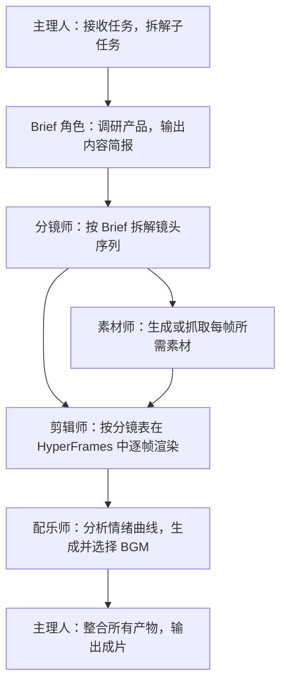

# 多 Agent 系統怎麼設計？用一支產品宣傳片專家團講透分工與交接

你想讓 AI 一次性幹完一件大活，結果它東一榔頭西一棒槌，質量還飄忽不定。你的問題往往不在模型，而在「沒分工」。你別急著上多 Agent，先看這篇怎麼拆。這篇用一個「產品宣傳片專家團」的真實案例，回答多 Agent 系統的三個核心問題：怎麼設計分工、怎麼串聯產物、什麼時候才值得拆。


## 單 Agent 和多 Agent 的真正差別

你先看清這張表——多 Agent 貴在「分」，不在「多」：

| 維度 | 單 Agent | 多 Agent |
| --- | --- | --- |
| 上下文 | 所有資訊在一個任務 | 角色只接收必要上下文 |
| 分工 | 一個執行體序列完成 | 多角色並行或接力 |
| 工具 | 同一組權限 | 可按角色隔離工具和權限 |
| 質量 | 自己生成、自己檢查 | 可設定獨立評審者 |
| 成本 | 較低 | 協調、模型和工具呼叫更多 |
| 風險 | 一處錯誤影響整體 | 錯誤可能在角色間傳播 |

多 Agent 的價值來自**專業分工、並行、權限隔離或獨立評審**，不來自角色數量。你拿這張表對一下：如果你現在的活一個人序列就能幹完，那就別拆。


## 任務是否值得拆分

你手上的活，滿足下面越多條，越適合上多 Agent：

- 至少兩個子任務可以獨立進行；
- 子任務需要不同方法、資料或工具；
- 輸出可以定義清楚的交接格式；
- 並行能顯著縮短等待；
- 有明確總負責人和最終驗收；
- 預算允許多輪呼叫。

只改一封郵件、總結一份 PDF 或格式化一個表格，你不需要專家團。你照這六條卡一下，命中三條以上再拆。

## 案例：產品宣傳片專家團

### 任務背景

HyperFrames 是 HeyGen 開源的影片渲染框架，核心特點是對 AI Agent 友好：Agent 可以自動生成基於 HTML 的影片幀並渲染輸出。產品宣傳片有相對固定的套路——無需口播和演員，主要由產品展示、概念字幕和 BGM 構成，適合 Agent 團隊分工處理。你先知道 HyperFrames 是什麼，再看成片怎麼拆。


### 工序設計

你先看這張工序圖，它把一支宣傳片拆成了六道工序：



你看著這張圖，每一道工序都有明確的交接物。

### 角色契約

你給每個角色定死「輸入、輸出、禁止動作」，它們才不會互相越界：

| 角色 | 輸入 | 輸出 | 禁止動作 |
| --- | --- | --- | --- |
| 主理人 | 使用者任務描述、素材空間 | 任務拆解、狀態追蹤、成片 | 不跳過子任務驗收直接交付 |
| Brief 角色 | 產品官網、介紹檔案 | brief.md（定位、價值、使用者） | 不直接寫指令碼 |
| 分鏡師 | brief.md | 分鏡表（時間碼、畫面、字幕、轉場） | 不引入 Brief 未確認的資訊 |
| 素材師 | 分鏡表 | 產品截圖、概念圖、介面素材 | 不使用無版權來源素材 |
| 剪輯師 | 素材、分鏡表 | 逐幀 MP4 片段 | 不改動分鏡結構 |
| 配樂師 | 分鏡表、情緒標註 | BGM 候選及推薦理由 | 不只輸出一個選項 |

你照這張契約表定角色，越清楚越不容易亂。

### 專家團演示

你做產品宣傳片前，先把相關素材放到工作空間內：

```text
我希望你做一個產品宣傳片，具體的話，是宣傳騰訊的 WorkBuddy 最新的專家團，
主打 OPC 場景。當前空間下我放了一些素材，成片風格可以偏 Apple 風格、
真實軟體介面。整個過程全自動。
```


團長先把「做一支宣傳片」拆成一串子任務：先搞清楚產品是什麼、賣給誰、核心價值是什麼；再決定敘事結構、鏡頭數量、節奏；然後分頭做素材、剪輯、配樂。你派完活，剩下看團長怎麼拆。

Brief 角色先開工，翻一遍官網和產品介紹，輸出一份 brief：這是什麼產品、目標使用者是誰、最值得放進 60 秒的幾個核心點。分鏡師接著 brief 幹活，把 60 秒拆成 7 個鏡頭，細到時間碼、畫面、文字、轉場、動效和素材型別。素材師和剪輯師開始幹活：一個生成/抓產品截圖和概念圖，另一個把素材按分鏡表往 HyperFrames 裡塞，逐鏡頭渲染 MP4。

最有意思的是配樂師：它不是簡單寫個「科技感 BGM」的 prompt 完事，而是先讀分鏡表，研究每個鏡頭的情緒曲線——哪裡需要鼓點卡產品 reveal、哪裡需要降下來做留白、哪裡需要一個 hit point 推 CTA——然後才呼叫音樂模型生成候選。團長整合所有產物，再跑一道剪輯輸出成片。


你在這裡基本是甩手掌櫃：派活、看關鍵節點、再拍板——分鏡要不要這麼排、BGM 喜不喜歡、字幕文案要不要改。

## 共享產物層

多個 Agent 不應各自維護一份「產品事實」，你建立單一產物路徑，下游只讀上游確認過的檔案：

```text
project/
├── brief.md                  # 產品簡報（Brief 角色產出，主理人確認）
├── storyboard.md             # 分鏡表（分鏡師產出，主理人確認）
├── assets/                   # 素材（素材師產出）
│   ├── screenshots/
│   └── concepts/
├── clips/                    # 逐幀片段（剪輯師產出）
├── bgm/                      # BGM 候選（配樂師產出）
└── output/final.mp4          # 成片（主理人整合）
```

你讓產物層當唯一真相源，別讓角色各存一份。你讓下游角色只讀取上游已確認的產物。角色之間不通過對話傳遞關鍵內容細節。

## 並行與序列

- **可以並行**：素材生成與剪輯準備、不同鏡頭段落的渲染；
- **必須序列**：Brief 確認後才寫分鏡、分鏡確認後才生成素材、素材就緒後才剪輯、成片完成後才配樂合成。

你並行計劃必須標明匯合點：素材和剪輯可以並行準備，但最終合成必須等待所有素材就位。你排並行時，先把匯合點標出來。

## 主理人的職責

主理人（製片人）是工作流控制器：解釋使用者任務並維護子任務狀態；分發最小必要上下文；檢查上游產物是否滿足交接格式；決定並行、等待或重試；在關鍵節點請使用者拍板；彙總所有產物執行最終合成；對成片做一致性檢查。

你記住三個必須由人確認的點：Brief 確認（定位、使用者、賣點是否準確）、分鏡確認（敘事結構、鏡頭數量、節奏）、BGM 選擇（情緒風格是否匹配調性）。Agent 負責生成和執行，不能替代你做品牌方向和風格判斷。

## 從自建到預置專家團

| 維度 | 自建 Skills | 預置專家團 |
| --- | --- | --- |
| 適用人群 | 開發者，需要深度定製 | 一人公司，直接使用 |
| 上手門檻 | 高（需定義角色、除錯流程） | 低（描述任務即可） |
| 靈活度 | 高（可修改任意環節） | 中（支援自定義模型接入） |
| 速度 | 取決於搭建時間 | 即開即用 |

你建立自己的專家團也很簡單：專家 → 我的專家 → 建立專家，跳轉到 WorkBuddy 對話方塊，按給定格式即可快速建立。你選自建還是預置，看你會不會寫角色。


當前專家團覆蓋的典型場景：

| 場景類別 | 代表專家團 |
| --- | --- |
| 內容創作 | 產品宣傳片、爆款內容創作、全域分發 |
| 軟體研發 | 軟體開發、程式碼測試 |
| 商業分析 | 深度研究、投資分析、資料分析 |
| 業務支援 | SEO、銷售、營銷、財稅合規、HR |
| 法律合規 | 中文法律 |


## 質量影響因素

- **Agent 底座模型**：指令跟隨和推理能力直接影響分鏡質量和任務拆解準確性；
- **影像生成模型**：影響產品截圖的清晰度和概念圖的視覺質量；
- **使用者提供的素材**：你提前把素材放進空間，成片才貼得住真實產品，不至於讓 Agent 拿通用素材湊數；
- **瀏覽器工具接入**：Agent 具備瀏覽器操作能力時可自動抓取官網截圖和產品介面。

全自動方案適合快速出片；對品質要求高的場景，你建議以 Agent 產物為基礎再做一輪人工二次剪輯。你素材越齊，成片越真。

## 失敗傳播控制

| 角色失敗 | 降級方式 |
| --- | --- |
| Brief 角色無法獲取產品資訊 | 使用者補充基礎資訊後重試 |
| 素材生成失敗 | 使用使用者預置素材或標記空缺位置 |
| 剪輯渲染超時 | 交付已完成的片段和分鏡表 |
| BGM 生成失敗 | 提供推薦 BGM 型別描述，由使用者自選 |
| 主理人合成失敗 | 交付各角色產物清單，由使用者手動合成 |

你讓降級交付必須說明缺失內容，不偽裝成完整成果。你讓降級說明缺了什麼，別糊弄。

## 多 Agent 任務 Brief 模板

你照這個模板描述任務，專家團才知道怎麼拆：

```text
目標：為 [產品名稱] 製作一支 [時長] 的產品宣傳片。
風格：[參考風格，如 Apple 風、極簡風]。
素材：[素材空間路徑或已提供的圖片/影片]。
角色：主理人、Brief、分鏡師、素材師、剪輯師、配樂師。
確認節點：Brief 完成後、分鏡完成後、BGM 選擇時，需使用者確認後繼續。
模型：Agent 模型 [指定]；影像生成模型 [指定]。
全自動/半自動：[說明是否需要中間節點人工介入]。
```

你照模板填，專家團才拆得動。

## 常見問題

**什麼任務才值得拆成多 Agent？**
你滿足這幾條才值得：至少兩個子任務能獨立幹、需要不同工具或資料、產物能定義清楚的交接格式、並行能省時間，還得有明確驗收人。改封郵件、總結 PDF 這類小事，單 Agent 就夠了。

**多 Agent 是不是角色越多越好？**
不是。價值來自分工、並行、權限隔離和獨立評審，跟數量無關。你角色堆太多，協調成本和出錯面反而更大。

**哪些節點必須你親自確認？**
三處：Brief 確認（定位、使用者、賣點準不準）、分鏡確認（結構和節奏）、BGM 選擇（情緒風格）。Agent 能生成能執行，但品牌方向得你拍板。

**共享產物層是幹嘛的？**
你建一條單一產物路徑，下游角色只讀上游已確認的檔案，不在對話裡傳關鍵細節。這樣某個角色改了，其他人不會拿到過期版本。

**專家團掛了怎麼降級？**
按失敗傳播控制表來：Brief 拿不到資訊就你補基礎資訊，素材生成失敗就標空缺或用你預置素材，剪輯超時就交已完成的片段。降級必須說清缺了什麼，不冒充完整成果。
